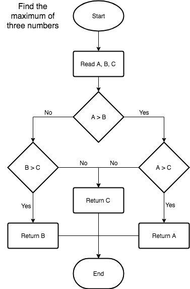

# Computer Science Distilled

## Summary - Chapter 1: Basics

> Computer science is not about machines, in the same way that astronomy is not about telescopes.
> There is an essential unity of mathematics and computer science.
>
> -- _Edsger Dijkstra_

**:dart: Objectives:**

> * _Model Ideas into flowcharts and pseudocode_
> * _Know right from wrong with logic_
> * _Count stuff_
> * _Calculate probabilities_

---

### Section 1: Ideas

#### 1.1 - Intro

##### organizing methods - write everything down

> It is very easy for our brains to overflow with fact and ideas, **dump all important stuff on paper**.

##### ways to break down a problem

> There are different ways to help you break down a problem into smaller processable chunks:
>
> * Flowcharts
> * Pseudocode
> * Math Modeling _(important to express abstract ideas)_

#### 1.2 - Flowcharts

##### guidelines to write flowcharts

> * write states and instruction steps inside rectangles
> * write decision steps, where the process may go different ways, inside diamonds
> * never mix an instruction step with a decision step
> * connect sequential steps with an arrow
> * mark the start and end of the process

##### example of a flowchart:



#### 1.3 - Pseudocode

##### what's pseudocode?

> human-friendly code that expresses computational processes

##### example of a pseudocode:

```bash
# max of three numbers

function maximum (A, B, C)
  if A > B
    if A > C
      max <- A
    else
      max <- C
  else
    if B > C
      max <- B
  else
      max <- C

  return max
```

#### 1.4 - Mathematical Models

**:bulb: Tip:**

> _stand on the shoulders of giants who created these tools_

##### what's a model?

> a set of concepts that represents a problem and its characteristics

##### example of a mathematical model:

###### Problem: Livestock Fence

> _Your farm has two types of livestock. You have 100 units of barbed wire to make a rectangular fence for the animals, with a straight division for separating them._
>
> _How do you frame the fence in order to maximize the pasture's area?_

###### Solution: Livestock Fence

> Quadratic equation:
>
> $$ A = w·l $$
> $$ 100 = 2w + 3l $$
> $$ l = \frac{100-2w}{3} $$
> $$ A = \frac{100}{3}w - \frac{2}{3}w^2 $$

---

### Section 2: Logic

#### 2.1 - Intro

#### 2.2 - Operators

#### 2.3 - Boolean Algebra

#### 2.4 - Truth Tables

#### 2.5 - Logic in Computing

---

### Section 3: Counting

#### 3.1 - Intro

#### 3.2 - Multiplying

#### 3.3 - Permutations

#### 3.4 - Permutations with identical items

#### 3.5 - Combinations

#### 3.6 - Sums

---

### Section 4: Probability

#### 4.1 - Intro

#### 4.2 - Counting Outcomes

#### 4.3 - Independent Events

#### 4.4 - Mutually Exclusive Events

#### 4.5 - Complementary Events

#### 4.6 - The Gambler's Fallacy

#### 4.7 - Advanced Probabilities

---

## TODO reorganize

### Truth Tables

(http://kias.dyndns.org/comath/21.html)

AND (conjunction)
---
| p | q | p & q |
|---|---|:-----:|
| T | T |   T   |
| T | F |   F   |
| F | T |   F   |
| F | F |   F   |

OR (disjunction)
---
| p | q | p \| q |
|---|---|:------:|
| T | T |    T   |
| T | F |    T   |
| F | T |    T   |
| F | F |    F   |

NOT (negation | inversion)
---
| p | ~p |
|---|:--:|
| T |  F |
| F |  T |

XOR (eXclusive OR)
---
| p | q | p X q |
|---|---|:-----:|
| T | T |   F   |
| T | F |   T   |
| F | T |   T   |
| F | F |   F   |

  * p X q is T if either p or q is T, but not both

IMPLIES (implication)
---
| p | q | p -> q |
|---|---|:------:|
| T | T |   T    |
| T | F |   F    |
| F | T |   T    |
| F | F |   T    |

  * A `TRUE` premise implies a `TRUE` conclusion, `T -> T is T`
  * A `TRUE` premise can not imply a `FALSE` conclusion, `T -> F is F`
  * You can conclude anything from a `FALSE` assumption, `F -> * is T`
  * CONTRAPOSITIVE. If `A -> B`, its contrapositive is `!B -> !A`

EQUIVALENCE
---
| p | q | p <-> q |
|---|---|:-------:|
| T | T |    T    |
| T | F |    F    |
| F | T |    F    |
| F | F |    T    |

### Operators Precedence

  1. NOT
  2. AND,
  3. OR, XOR
  4. IMPLIES, EQUIVALENCE

### Boolean Algebra

Associativity

`A AND (B AND C) = (A AND B) AND C`

`A OR (B OR C) = (A OR B) OR C`

Distributivity

`A AND (B OR C) = (A AND B) OR (A AND C)`

`A OR (B AND C) = (A OR B) AND (A OR C)`

DeMorgan's Law

`!(A AND B) = !A OR !B`

`!A AND !B = !(A OR B)`
