# Computer Science Distilled

## Summary - Chapter 1: Basics

> Computer science is not about machines, in the same way that astronomy is not about telescopes.
> There is an essential unity of mathematics and computer science.
>
> -- _Edsger Dijkstra_

**:dart: Objectives:**

> * _Model Ideas into flowcharts and pseudocode_
> * _Know right from wrong with logic_
> * _Count stuff_
> * _Calculate probabilities_

---

### Section 1: Ideas

#### 1.1 - Intro

##### organizing methods - write everything down

> It is very easy for our brains to overflow with fact and ideas, **dump all important stuff on paper**.

##### ways to break down a problem

> There are different ways to help you break down a problem into smaller processable chunks:
>
> * Flowcharts
> * Pseudocode
> * Math Modeling _(important to express abstract ideas)_

#### 1.2 - Flowcharts

##### guidelines to write flowcharts

> * write states and instruction steps inside rectangles
> * write decision steps, where the process may go different ways, inside diamonds
> * never mix an instruction step with a decision step
> * connect sequential steps with an arrow
> * mark the start and end of the process

##### example of a flowchart:


#### 1.3 - Pseudocode

##### what's pseudocode?

> human-friendly code that expresses computational processes

##### example of a pseudocode:

```bash
# max of three numbers

function maximum (A, B, C)
  if A > B
    if A > C
      max <- A
    else
      max <- C
  else
    if B > C
      max <- B
  else
      max <- C

  return max
```

> Code: [max-of-three-numbers.js](./algorithms/max-of-three-numbers.js)

#### 1.4 - Mathematical Models

**:bulb: Tip:**

> _stand on the shoulders of giants who created these tools_

##### what's a model?

> a set of concepts that represents a problem and its characteristics

##### example of a mathematical model:

> __Livestock Fence__
>
> _Your farm has two types of livestock. You have 100 units of barbed wire to make a rectangular fence for the animals, with a straight division for separating them._
>
> _How do you frame the fence in order to maximize the pasture's area?_

**Solution:**

> Quadratic equation:
>
> $$ A = w \times l $$
> $$ 100 = 2w + 3l $$
> $$ l = \frac{100-2w}{3} $$
> $$ A = \frac{100}{3}w - \frac{2}{3}w^2 $$

---

### Section 2: Logic

#### 2.1 - Intro

Topics covered in this section:

> * Logic statements
> * Operators
> * Special Algebra

##### Mathematical Logic

> _variables_ and _operators_ represent validity of things, expressing `true` or `false` values

#### 2.2 - Operators

##### NOT (negation | inversion)

> `!A` or `~A`

| A | ~A |
|---|:--:|
| T |  F |
| F |  T |

##### IMPLIES (implication)

> Dependency between variables
>
> `A -> B` implies that `B` depends on `A` to be `true`
>
> Example: _If it rains, then I'll take my umbrella_
>
> _**Notice:** `A -> B` is NOT equivalent to `B -> A`_ this is called **inverse error**
>
> _**Notice:** `A -> B` is equivalent to `!A | B`_

| A | B | A -> B |
|---|---|:------:|
| T | T |   T    |
| T | F |   F    |
| F | T |   T    |
| F | F |   T    |

>
> A `true` premise implies a `true` conclusion. `T -> T = T`
>
> A `true` premise can NOT imply a `false` conclusion. `T -> F = F`
>
> You can conclude anything from a `false` assumption. `F -> * = T`

##### CONTRAPOSITIVE

> _If `A -> B` then the contrapositive is `!B -> !A`_
>
> Example: _If You love me, I'll kiss you_
>
> _**Notice:** `A -> B` is the same as `!B -> !A`_
>
> Example: _I won't kiss you if you don't love me_

##### EQUIVALENCE (biconditional)

> `A <-> B` expresses that `A` depends on `B` and viceversa
>
> Example: _I'll kiss you only if you love me_ or _Only if you love me I'll kiss you_

| A | B | A <-> B |
|---|---|:-------:|
| T | T |    T    |
| T | F |    F    |
| F | T |    F    |
| F | F |    T    |

##### AND (conjunction)

> `A & B` or $A \bigwedge B$

| A | B | A & B |
|---|---|:-----:|
| T | T |   T   |
| T | F |   F   |
| F | T |   F   |
| F | F |   F   |

##### OR (disjunction)

> `A | B` or $A \bigvee B$

| A | B | A \| B |
|---|---|:------:|
| T | T |    T   |
| T | F |    T   |
| F | T |    T   |
| F | F |    F   |

##### XOR (eXclusive OR)

> `A XOR B`
>
> _**Notice:** `A XOR B` is equivalent to `!(A <-> B)`_

| A | B | A X B |
|---|---|:-----:|
| T | T |   F   |
| T | F |   T   |
| F | T |   T   |
| F | F |   F   |

> _**Notice:** `A X B` is `T` if either `A` or `B` is `T`, but not both._

##### Summary - Logical operations table

| A  | B  | !A | A -> B | A <-> B | A & B | A \| B | A xor B |
|:--:|:--:|:--:|:------:|:-------:|:-----:|:------:|:-------:|
| ✓  | ✓  | ✗  | ✓      | ✓       | ✓     | ✓      | ✗       |
| ✓  | ✗  | ✗  | ✗      | ✗       | ✗     | ✓      | ✓       |
| ✗  | ✓  | ✓  | ✓      | ✗       | ✗     | ✓      | ✓       |
| ✗  | ✗  | ✓  | ✓      | ✓       | ✗     | ✗      | ✗       |

##### Operators Precedence

> 1. `NOT`
> 2. `AND`,
> 3. `OR`, `XOR`
> 4. `IMPLIES`, `EQUIVALENCE`

#### 2.3 - Boolean Algebra

Boolean Algebra simplifies logical expressions.

`Boolean` comes from __George Bool.__

##### Associativity

> `A AND (B AND C) = (A AND B) AND C`
>
> `A OR (B OR C) = (A OR B) OR C`

##### Distributivity

> `A AND (B OR C) = (A AND B) OR (A AND C)`
>
> `A OR (B AND C) = (A OR B) AND (A OR C)`

##### De Morgan's Law

> `!(A AND B) = !A OR !B`
>
> `!A AND !B = !(A OR B)`

###### Problem: [Hot Server](./problems/hot-server.md)

#### 2.4 - Truth Tables

##### A truth table has...

> **columns** for each variable
>
> **rows** to represent possible combinations of variable states
>
> `Note:` A truth table with `30` variables can have more than a billion rows.
>
> $2^{30} = 1,073,741,824$

##### example of a truth table

|v1|v2|v3|
|--|--|--|
|:white_check_mark:|:white_check_mark:|:white_check_mark:|
|:white_check_mark:|:white_check_mark:|:x:|
|:white_check_mark:|:x:|:white_check_mark:|
|:white_check_mark:|:x:|:x:|
|:x:|:white_check_mark:|:white_check_mark:|
|:x:|:white_check_mark:|:x:|
|:x:|:x:|:white_check_mark:|
|:x:|:x:|:x:|

> `3` variables = `8` possible combinations:
>
> $2^3 = 8$

###### Problem: [Fragile System](./problems/fragile-system.md)

#### 2.5 - Logic in Computing

##### logic gates...

> perform logic operations on electric current

---

### Section 3: Counting

#### 3.1 - Intro

> __Counting__ and __Logic__ belong to an important field to computer science called __Discrete Mathematics__.

#### 3.2 - Multiplying

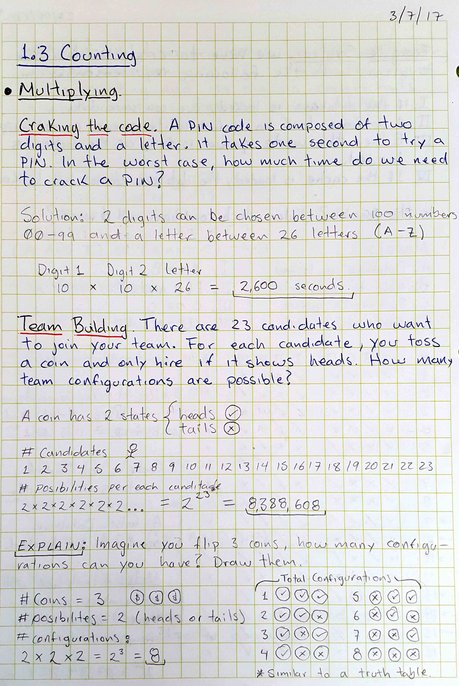

#### 3.3 - Permutations

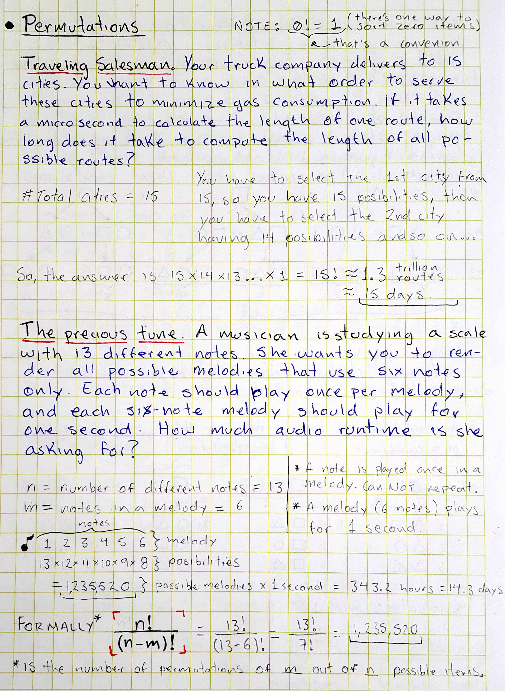
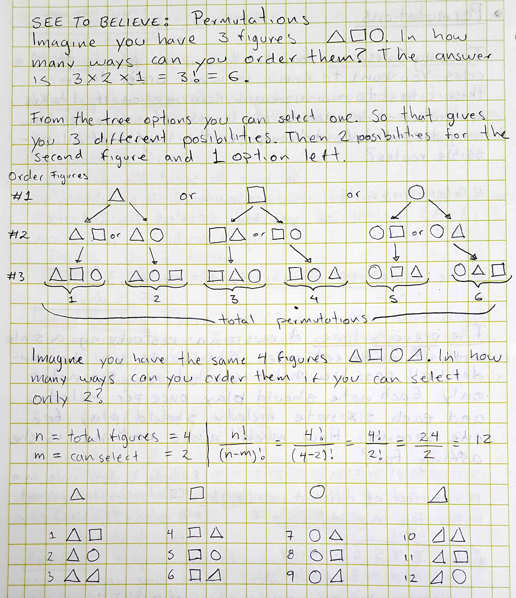

#### 3.4 - Permutations with identical items

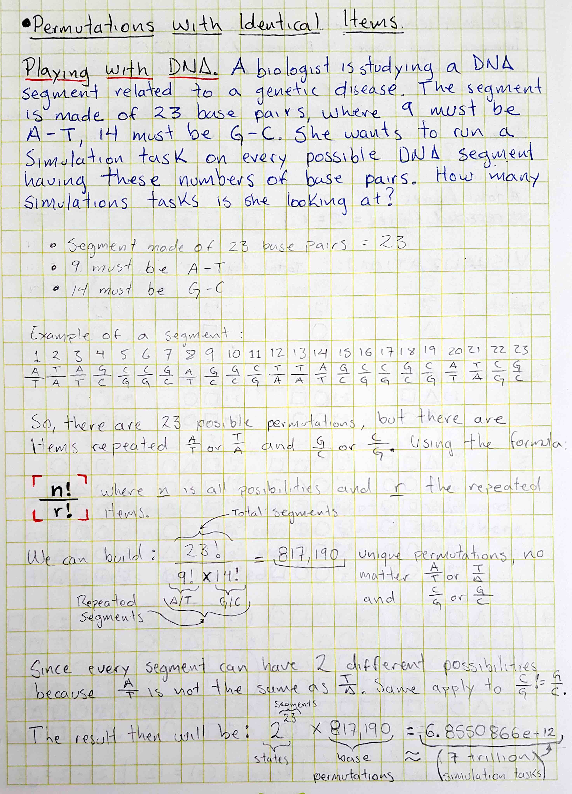
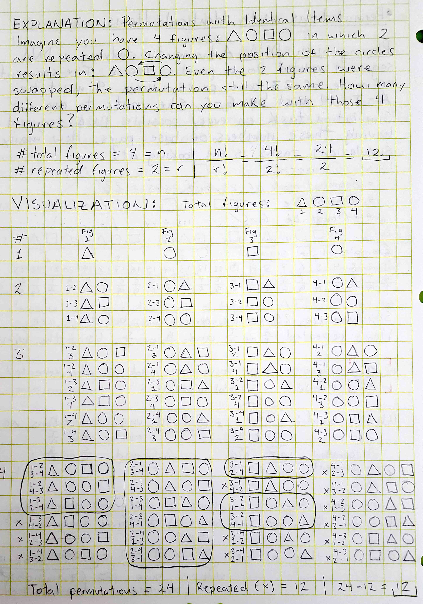

#### 3.5 - Combinations

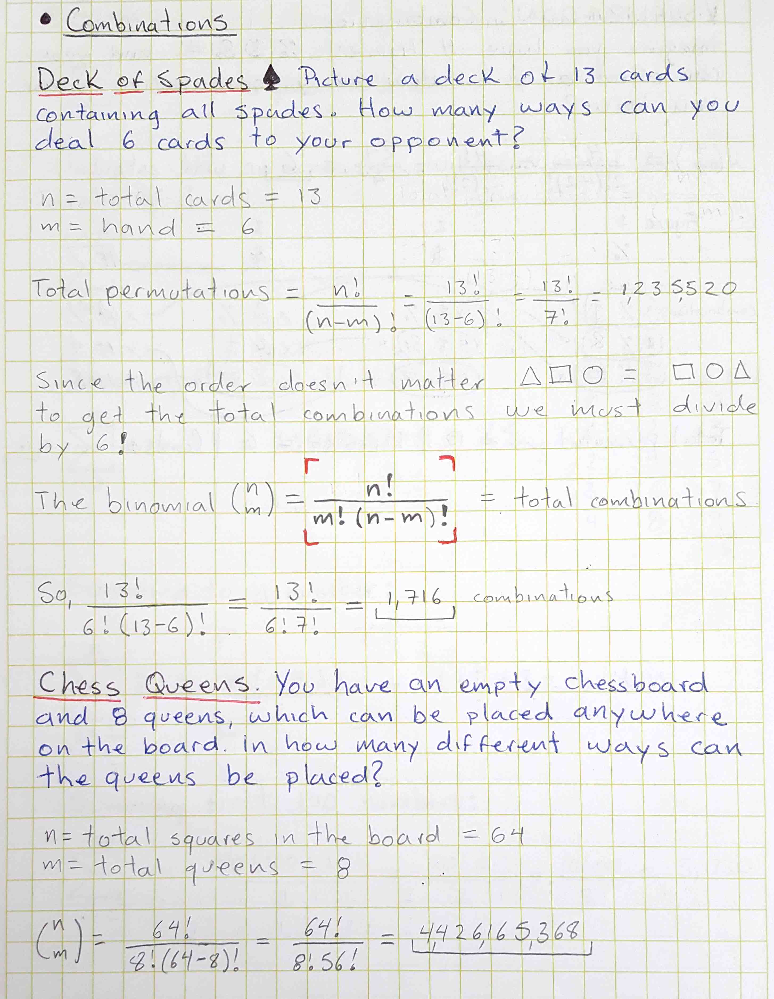
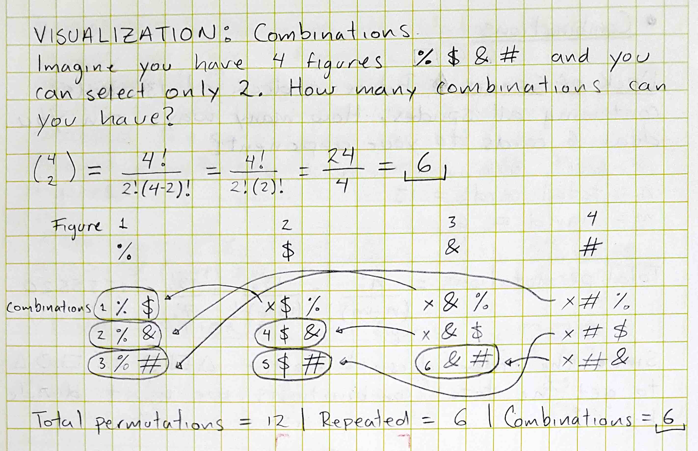

#### 3.6 - Sums

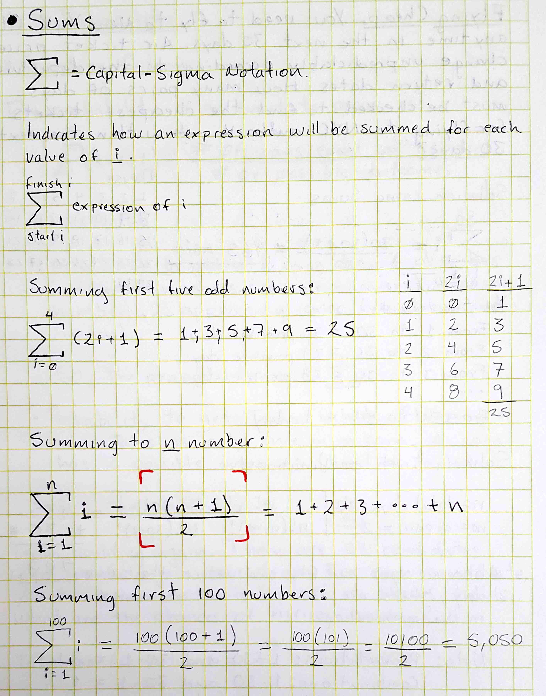
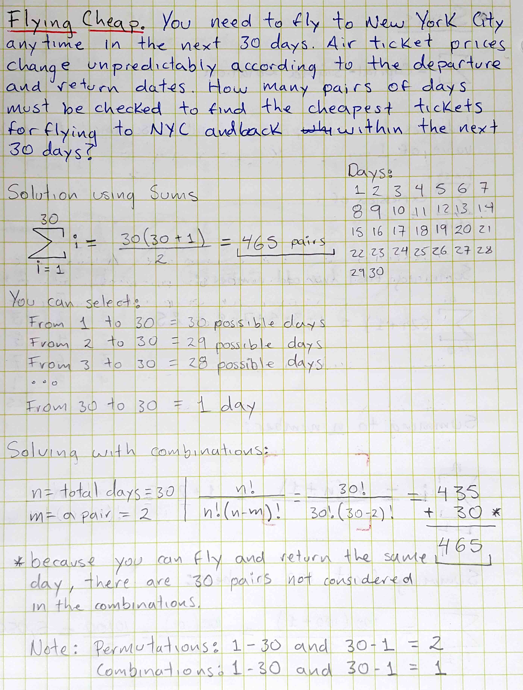

---

### Section 4: Probability

#### 4.1 - Counting Outcomes

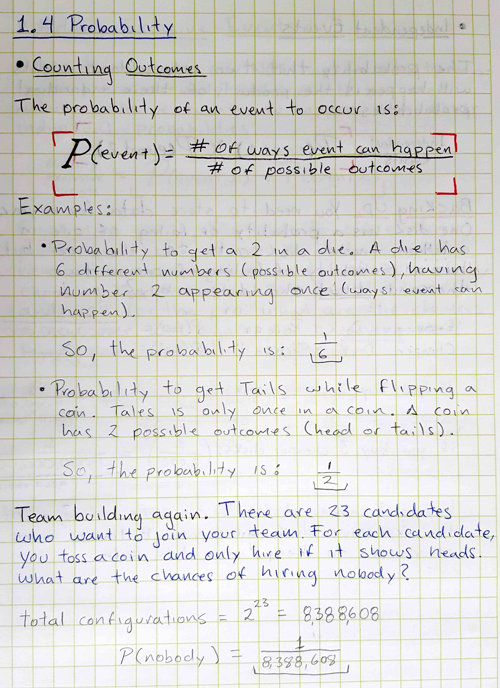

#### 4.2 - Independent Events

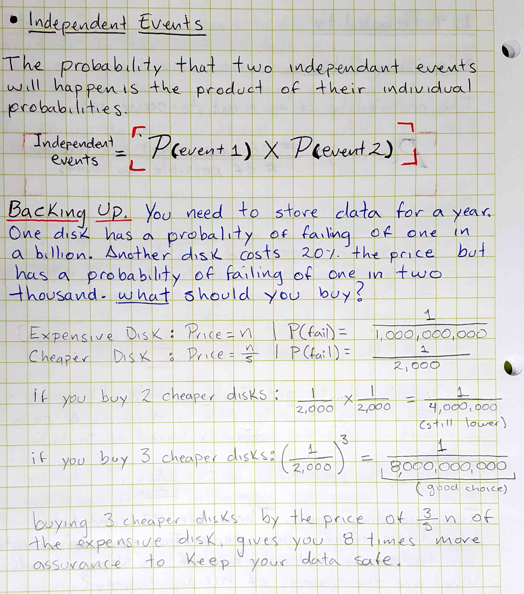

#### 4.3 - Mutually Exclusive Events

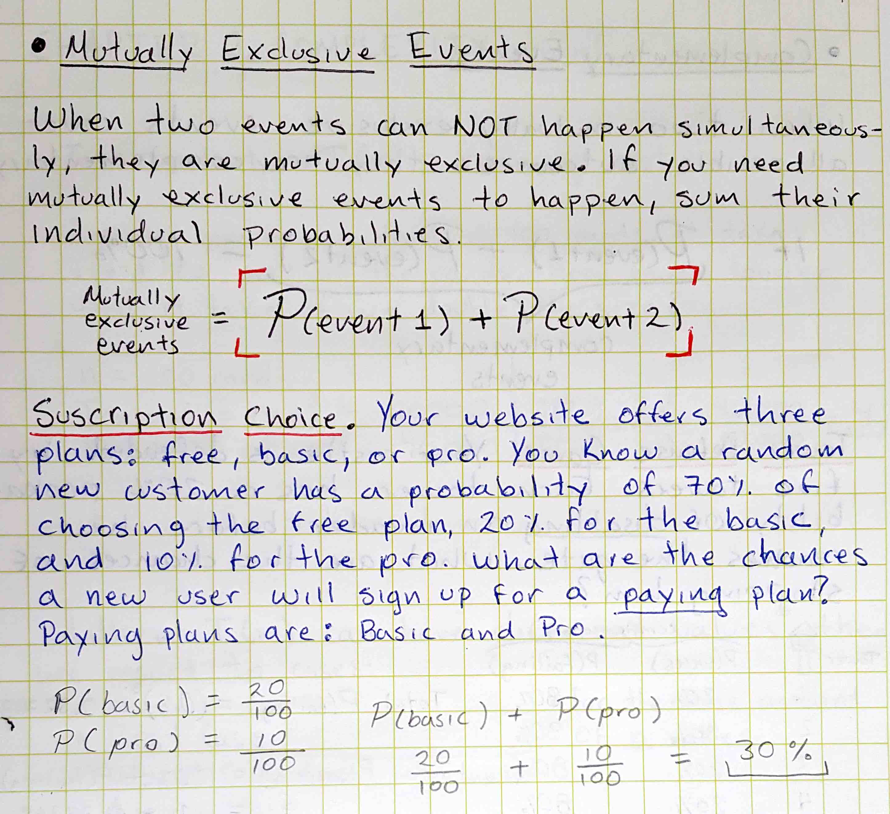

#### 4.4 - Complementary Events

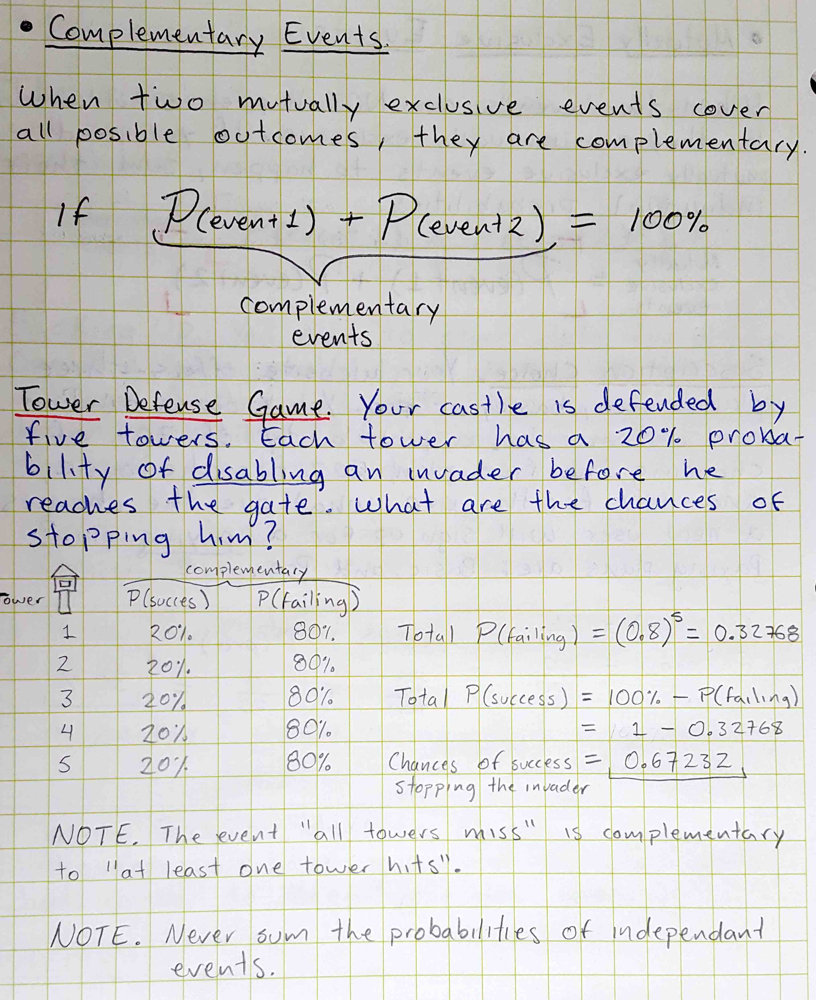

#### 4.5 - The Gambler's Fallacy

> "Past events never affect the outcome of an independent event."

## References:

* [Logical Operations and Truth Tables](http://kias.dyndns.org/comath/21.html)

### In the book:

* [xkcd: An Apple for a Dollar](https://xkcd.com/)
* [Programmer's Life (@ProgrammersLife) | Twitter](https://twitter.com/programmerslife)
* [Wolfram|Alpha: Computational Intelligence](https://www.wolframalpha.com/)
* [Solving the Zebra Puzzle with Boolean Algebra](https://code.energy/solving-zebra-puzzle/)
* Discrete Mathematics and its Applications, 7th Edition
